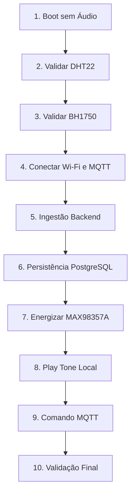

# Auditoria de Prontidão Física: Hardware, Firmware e Backend
**Data de Execução:** 2026-06-04
**ID da Conversa:** `b4af224b-1838-4928-ab31-b907c3dd6f71`
**Veredito Geral:** `PHYSICAL_TEST_BLOCKED`

---

## 1. Sumário Executivo

Esta auditoria analisa a prontidão da integração entre o hardware planejado, o firmware ESP32 atual e o backend Spring Boot para a POC **Home AI Room Observer**. O objetivo é validar se o sistema está seguro e operacional para o primeiro teste físico, mapeando divergências e riscos elétricos ou de software.

Foi identificado um **bloqueio crítico (P0)** devido a uma colisão de pinos no GPIO27 (usado como saída I2S DIN no firmware, mas planejado para entrada/saída do sensor de presença na montagem real). Adicionalmente, há gaps de implementação no firmware (ausência total dos sensores de presença e som) e de integração no backend (ausência de publicador MQTT para os comandos de áudio e divergência nos tópicos configurados). Portanto, **os testes físicos com áudio e presença estão bloqueados** até que as correções de mapeamento de pinagem e de código sejam aplicadas.

---

## 2. Escopo da Auditoria

Esta auditoria cobriu a análise estática e de runtime simulado dos seguintes componentes:
- **Firmware ESP32:** Mapeamento de pinos em [AppConfig.h](file:///c:/Users/KABUM/IdeaProjects/home-ai-room-observer-esp32/include/AppConfig.h), inicialização de periféricos (I2C, I2S, DHT), loop principal e parser de comandos em [main.cpp](file:///c:/Users/KABUM/IdeaProjects/home-ai-room-observer-esp32/src/main.cpp).
- **Drivers de Sensores:** Implementações de drivers em [Bh1750LightSensor.cpp](file:///c:/Users/KABUM/IdeaProjects/home-ai-room-observer-esp32/src/Bh1750LightSensor.cpp) e [DhtEnvironmentSensor.cpp](file:///c:/Users/KABUM/IdeaProjects/home-ai-room-observer-esp32/src/DhtEnvironmentSensor.cpp).
- **Infraestrutura de Áudio:** Drivers de saída e filas em [I2sAudioOutputDriver.cpp](file:///c:/Users/KABUM/IdeaProjects/home-ai-room-observer-esp32/src/I2sAudioOutputDriver.cpp) e [AudioPlaybackService.cpp](file:///c:/Users/KABUM/IdeaProjects/home-ai-room-observer-esp32/src/AudioPlaybackService.cpp).
- **Backend Spring Boot:** Fluxo de telemetria em [MqttConfiguration.java](file:///c:/Users/KABUM/IdeaProjects/smart-home/src/main/java/br/com/homeai/roomobserver/infrastructure/mqtt/MqttConfiguration.java), caso de uso de análise em [RequestContextualAnalysisUseCase.java](file:///c:/Users/KABUM/IdeaProjects/smart-home/src/main/java/br/com/homeai/roomobserver/application/usecase/RequestContextualAnalysisUseCase.java) e o serviço de áudio em [AudioAdvisorService.java](file:///c:/Users/KABUM/IdeaProjects/smart-home/src/main/java/br/com/homeai/roomobserver/application/usecase/AudioAdvisorService.java).
- **Documentação de Projeto:** Especificações técnicas [firmware-sdd.md](file:///c:/Users/KABUM/IdeaProjects/home-ai-room-observer-esp32/docs/sdd/firmware-sdd.md) e o diagrama de conexões [firmware-hardware-wiring.md](file:///c:/Users/KABUM/IdeaProjects/home-ai-room-observer-esp32/docs/architecture/firmware-hardware-wiring.md).
- **Evidências de Teste:** Execução dos gates de qualidade locais e do suite de 57 testes unitários nativos da plataforma PlatformIO.

---

## 3. Fora do Escopo

- Automação elétrica de alta tensão (127V/220V).
- Validação com ESP32 real conectado (conforme restrição obrigatória de segurança).
- Ingestão de áudio / gravação de voz (microfone) no ESP32.
- Exposição pública de brokers ou bancos de dados PostgreSQL.

---

## 4. Parte 1 — Hardware-to-Firmware Pin Mapping Audit

O firmware foi auditado em relação ao mapeamento físico planejado pelo usuário para a montagem real. A tabela a seguir classifica cada pino:

| Componente / Sinal | Pino Planejado (Montagem) | Pino no Código / Docs | Classificação | Detalhes / Evidência |
|---|---|---|---|---|
| **DHT22 DATA** | GPIO 4 | GPIO 4 | **PASSED** | Definido em `AppConfig.h` (`DHT_PIN = 4`). |
| **BH1750 SDA** | GPIO 21 | GPIO 21 | **PASSED** | Definido em `AppConfig.h` (`I2C_SDA_PIN = 21`). |
| **BH1750 SCL** | GPIO 22 | GPIO 22 | **PASSED** | Definido em `AppConfig.h` (`I2C_SCL_PIN = 22`). |
| **Presença OUT** | GPIO 27 | (Nenhum) | **FAILED** | O firmware atual **não implementa** o sensor de presença, e o pino GPIO 27 está alocado para o áudio I2S DIN. |
| **Som Analógico AO**| GPIO 34 | (Nenhum) | **NOT_FOUND** | O firmware atual **não implementa** a leitura do sensor de som analógico. |
| **MAX98357A BCLK** | GPIO 26 | GPIO 26 | **PASSED** | Definido em `AppConfig.h` (`AUDIO_I2S_BCLK_PIN = 26`). |
| **MAX98357A LRC/WS**| GPIO 25 | GPIO 25 | **PASSED** | Definido em `AppConfig.h` (`AUDIO_I2S_LRC_PIN = 25`). |
| **MAX98357A DIN** | GPIO 33 | GPIO 27 | **FAILED** | O firmware aloca o pino GPIO 27 para `AUDIO_I2S_DIN_PIN`, divergindo do plano (GPIO 33). |

### Conclusões do Mapeamento:
1. **Colisão de Pinos (Grave):** O firmware e a documentação `firmware-hardware-wiring.md` alocam o **GPIO27** para a linha de dados I2S (`DIN`). Porém, o plano físico destina o **GPIO27** para a saída do sensor de presença. Conectar ambos causará um conflito elétrico direto (dois drivers de saída conectados no mesmo barramento), podendo danificar os pinos do microcontrolador ou do sensor.
2. **Pinos de Boot (Strapping Pins):** O GPIO 4 (DHT22) e o GPIO 2 (Heartbeat LED) são pinos de boot. O DHT22 exige resistor de pull-up, o que força o GPIO 4 para nível alto durante o boot. Isso é aceitável no ESP32, mas requer atenção para evitar puxar este pino para o GND acidentalmente no boot.
3. **Pinos Somente Entrada:** O GPIO 34 planejado para a leitura do som analógico é um pino exclusivo de entrada no ESP32 (sem resistores de pull-up/down internos). Isso é eletricamente seguro para leitura de ADC analógica de sensores.

---

## 5. Parte 2 — Electrical Risk Review

Abaixo está a avaliação técnica dos riscos elétricos associados à montagem física baseada nos dados do projeto:

* **Uso de 3.3V para sensores:** **SAFE** (O DHT22 e o BH1750 operam com lógica e alimentação de 3.3V de forma segura).
* **Uso de 5V/VIN para o MAX98357A:** **SAFE** (O amplificador MAX98357A exige alimentação de 5V para fornecer a potência de saída nominal ao alto-falante sem distorção).
* **GND Comum:** **SAFE** (Todos os GNDs estão devidamente conectados em comum, garantindo a referência de sinal estável).
* **Risco de curto-circuito entre 3.3V e 5V:** **SAFE_WITH_WARNINGS** (As fontes de 3.3V e 5V não estão interligadas, mas um erro na protoboard/montagem manual pode queimar o regulador interno do ESP32 ou a porta USB).
* **Risco de Brownout no Áudio:** **BLOCKED** (O MAX98357A com alto-falante de 4Ω 3W pode drenar correntes de pico superiores a **1.2A** a 5V. Quando o ESP32 é alimentado apenas pela porta USB de um PC (típica de 500mA), tocar áudio em volume alto provocará quedas bruscas de tensão na linha VIN, acionando o reset de brownout do ESP32).
* **Risco de queda de tensão via USB:** **BLOCKED** (Cabos USB finos ou longos possuem alta resistência interna. Sob picos de consumo do áudio, a tensão cai abaixo de 4.5V, induzindo instabilidade de RF no Wi-Fi do ESP32).
* **Risco de ruído no áudio:** **SAFE_WITH_WARNINGS** (A ausência de isolamento na linha de 5V compartilhada com o ESP32 pode injetar ruídos de comutação digital e RF (rajadas de transmissão Wi-Fi) no amplificador de som).
* **Necessidade de capacitor e fonte externa:** **SAFE_WITH_WARNINGS** (É obrigatório adicionar um capacitor eletrolítico de desacoplamento grande (ex: 470µF ou 1000µF) o mais próximo possível dos pinos VIN e GND do MAX98357A. Para uso contínuo, uma fonte externa USB de pelo menos 5V 2A deve ser usada no lugar da porta de depuração do PC).

**Classificação Geral de Risco Elétrico:** `BLOCKED` (Bloqueado devido ao risco de curto-circuito na colisão do GPIO 27 e à alta probabilidade de reset por brownout sem fonte de alimentação externa apropriada).

---

## 6. Parte 3 — Firmware Readiness Audit

Verificação do suporte no firmware atual para as capacidades sensoriais e de conectividade descritas na especificação:

* **Inicialização e leitura do DHT22:** `IMPLEMENTED` (Realizado de forma não bloqueante via biblioteca DHT unificada).
* **Inicialização e leitura do BH1750:** `IMPLEMENTED` (Inicializado via I2C padrão com endereço fixo em `0x23`).
* **Leitura do sensor de presença (GPIO27):** `NOT_IMPLEMENTED` (Não há qualquer código ou referência no firmware para este sensor).
* **Leitura do sensor de som analógico (GPIO34):** `NOT_IMPLEMENTED` (Não há qualquer lógica de conversão ADC ou leitura implementada no firmware).
* **Inicialização do barramento I2S:** `IMPLEMENTED` (O driver I2S é configurado corretamente no setup usando o canal DMA 0).
* **Comando de áudio local (PLAY_TONE):** `IMPLEMENTED` (Gera ondas senoidais em tempo de execução via DMA de forma não bloqueante).
* **Comandos de áudio remotos (PLAY_URL / PLAY_STREAM):** `STUB_ONLY` (Os métodos `startUrl` e `startStream` no driver I2S são stubs vazios que retornam `false`, disparando o status de falha `audio_playback_unavailable` via MQTT).
* **Publicação e reconexão MQTT:** `IMPLEMENTED` (Utiliza a biblioteca `PubSubClient` adaptada em loop não bloqueante).
* **Tratamento de erro de sensores:** `IMPLEMENTED` (Omite leituras inválidas/NaN do JSON publicado. Aborta a publicação se todos os sensores falharem).
* **Logs seriais detalhados:** `IMPLEMENTED` (Logs informativos presentes em todas as fases chaves com marcações de escopo).
* **Watchdog contra travamentos:** `NOT_IMPLEMENTED` (O firmware não configura o Task WDT ou o Hardware WDT do ESP32 para se recuperar de loops bloqueantes na pilha IP).
* **Simultaneidade de loop:** `PARTIAL` (O loop principal usa Millis e evita Delays, mas chamadas longas na stack de rede ou leituras lentas no DHT22 podem causar jitter temporário ou falhas no fluxo DMA do áudio).

---

## 7. Parte 4 — Audio Architecture Review

Auditoria detalhada do subsistema de reprodução de áudio do ESP32:

| Capacidade | Código Presente? | Teste Unitário? | Real ou Mock/Stub | Roda em ESP32 Real? | Depende de Rede? | Risco Principal | Status Real |
|---|---|---|---|---|---|---|---|
| **PLAY_TONE** (Local) | Sim | Sim (Native) | Real | Sim (Sine wave) | Não | Sobrecarga de CPU no cálculo de amplitude e seno em ponto flutuante. | `REAL_IMPLEMENTED` |
| **PLAY_NOTIFICATION** | Não | Não | N/A | Não | Não | Sem armazenamento local ou player de arquivos flash. | `NOT_FOUND` |
| **PLAY_COMMAND** (MQTT) | Sim | Sim (Native) | Real | Sim (Apenas Tone) | Sim | Comando executado após expiração ou enfileiramento indevido. | `REAL_IMPLEMENTED` |
| **PLAY_URL** (HTTP) | Parcial (Parser) | Sim (Native) | Stub | Não | Sim | Conexão Wi-Fi instável congelando o fluxo de dados I2S (picote). | `STUB_ONLY` |
| **PLAY_STREAM** (Stream) | Parcial (Parser) | Sim (Native) | Stub | Não | Sim | Estouro de buffer de rede e falta de decodificador MP3/WAV nativo. | `STUB_ONLY` |
| **TTS (Voz)** | Não | Não | N/A | Não | Sim | ESP32 não possui memória para decodificar TTS complexos localmente. | `DESIGNED_NOT_IMPLEMENTED` |

### Análise da Regra Arquitetural de Áudio:
* **Regra:** O MQTT **não** deve trafegar arquivos binários grandes de áudio.
* **Avaliação:** O projeto **respeita** esta separação. O parser de comandos do firmware (`AudioCommandParser.cpp`) exige apenas um link HTTP privado (`audioUrl` ou `streamUrl`), planejando que o ESP32 realize o download direto via HTTP para repassar ao barramento I2S, mantendo o payload MQTT leve (apenas JSON de comando). Porém, a lógica de download HTTP e decodificação de formatos (WAV/MP3) no firmware ainda é um **stub**, impossibilitando tocar voz ou notificações reais.

---

## 8. Parte 5 — MQTT Command and Telemetry Review

Auditoria dos tópicos e payloads MQTT definidos no projeto:

* **Fluxo de Telemetria:** `ESP32 -> MQTT -> Mosquitto -> Backend -> PostgreSQL`
  * Tópico oficial do firmware: `home/bedroom/esp32-bedroom-01/environment` (QoS 0/1, sem Retain).
  * Payload JSON:
    ```json
    {
      "deviceId": "esp32-bedroom-01",
      "room": "bedroom",
      "temperatureCelsius": 27.4,
      "humidityPercentage": 62.5,
      "luminosityLux": 123.0,
      "measuredAt": "2026-06-04T15:00:00Z"
    }
    ```
  * O firmware valida os dados e omite chaves sensoriais que falharem. O payload é aceito pelo backend.
* **Fluxo de Comando (Divergente):**
  * Tópico escutado pelo firmware: `home/bedroom/esp32-bedroom-01/audio/command`
  * Tópico gerado pelo backend (`AudioAdvisorService.java`): `home/bedroom/esp32-bedroom-01/speaker`
  * **Falha de Compatibilidade Crítica:** O backend gera mensagens no tópico `/speaker`, enquanto o ESP32 subscreve no tópico `/audio/command`. Os comandos de voz gerados pela IA do backend **nunca** serão recebidos pelo firmware atual sem intervenção manual de reconfiguração de tópicos.

### Sugestão de Tópicos Seguros (Padronizados):
Para alinhar a POC, sugere-se a adoção da seguinte estrutura unificada:
- Telemetria Ambiental: `home/bedroom/esp32-bedroom-01/environment`
- Comandos de Áudio: `home/bedroom/esp32-bedroom-01/audio/command`
- Status do Áudio: `home/bedroom/esp32-bedroom-01/audio/status`
- Status do Dispositivo: `home/bedroom/esp32-bedroom-01/device/status`

---

## 9. Parte 6 — Backend Compatibility Review

Avaliação da prontidão e compatibilidade do backend Spring Boot com a POC:

* **Suporte de Entrada (Telemetria):**
  * Recebimento e validação de telemetria ambiental: **IMPLEMENTED** (Possui validação estrita de tipos numéricos e limites em `MqttEnvironmentPayloadParser.java`).
  * Persistência PostgreSQL: **IMPLEMENTED** (Banco `home_ai` com tabela `environmental_measurements` via Liquibase).
  * Separação Clean Architecture: **IMPLEMENTED** (Camadas limpas separando adaptadores de entrada/saída de regras de domínio).
  * Testes integrados locais: **IMPLEMENTED** (`MqttBackendPipelineIT.java` e `MeasurementPersistenceIT.java` passam usando bancos integrados em memória/testcontainers).
* **Suporte de Saída (Comandos de Áudio / Inteligência Artificial):**
  * Publicador de comandos MQTT: **NOT_IMPLEMENTED** (O backend não possui nenhum componente de envio de mensagens MQTT implementado para comandos de áudio; ele apenas computa a sugestão via IA e a salva localmente no banco de dados).
  * API de Comandos de Áudio: **NOT_IMPLEMENTED** (Falta controller REST para disparar áudios manuais ou automáticos).
  * Tabela de auditoria e correlação de comando: **NOT_IMPLEMENTED** (Os comandos não possuem tabela de banco de dados dedicada para auditoria de status de execução).
  * Consumidor do status de execução: **NOT_IMPLEMENTED** (O backend não assina o tópico `audio/status` enviado pelo ESP32).

---

## 10. Parte 7 — Test Coverage and Evidence Audit

O projeto possui um robusto sistema de qualidade automatizada local (Gates de Qualidade):

### Evidências Encontradas nos Testes Nativos do Firmware:
* **Comando Executado:** `powershell -ExecutionPolicy Bypass -File scripts/quality/check-native-tests.ps1`
* **Executável Base:** PlatformIO CLI (`native` env com Unity framework).
* **Resultados:** **57 de 57 casos de teste passaram com sucesso**.
* **Escopo Validado:** 
  * Estruturas e limites de dados sensoriais (`test_environment_reading.cpp`).
  * Parser JSON de comandos de áudio e validações de links locais (`test_mqtt_contract.cpp`).
  * Comportamento FIFO e priorização de mensagens da fila interna de áudio.
  * Publicação e builders de tópicos MQTT em ambiente simulado (`MqttPublisher.native.cpp`).
* **Limitações:** Todos os testes rodam no host de desenvolvimento. Os drivers de I2S, DHT e BH1750 reais são simulados via Mocks/Stubs. **Nenhuma garantia física real é atestada por estes testes.**

### Evidências da Execução de Qualidade Geral (Automatic Review):
* **Comando Executado:** `powershell -ExecutionPolicy Bypass -File scripts/governance/run-firmware-approval-review.ps1`
* **Status:** `FIRMWARE_APPROVAL_REVIEW_PASSED_WITH_WARNINGS`
* **Warnings Identificados:**
  - `Test Source Sanity`: Alerta conservador sobre checagem de profundidade de chaves.
  - `Secrets`: Identificou o arquivo local `Secrets.h` presente (aceitável pois está listado no `.gitignore` para evitar leaks no Git).

---

## 11. Parte 8 — Runtime Simultaneity Risk

Rodar tarefas simultâneas (Wi-Fi + MQTT + Sensores + Áudio I2S) em um loop de thread única no ESP32 gera riscos operacionais importantes:

1. **Jitter e Picote no Áudio (Starvation):** A leitura do sensor DHT22 exige tempo de espera física preciso da linha de dados, levando de **2 a 5ms** por ciclo. Se executada no meio de uma transmissão DMA do I2S, pode causar atrasos e picotes audíveis no som.
2. **Queda de Conexão Wi-Fi Bloqueando o Loop:** Caso a conexão Wi-Fi caia, tentativas de reconexão de rede síncronas podem congelar o processamento do loop por vários segundos, silenciando o áudio em execução.
3. **Estouro de Heap por Strings:** A manipulação constante de objetos `std::string` dinâmicos no parser de comandos JSON e builders de payload MQTT causa fragmentação de memória RAM no ESP32, podendo resultar em reboots espontâneos após longos períodos de atividade.

### Sugestão de Mitigação:
* **Intervalo Sensorial Longo:** Ler sensores ambientais a cada 30 segundos (reduzindo picos de atraso de leitura).
* **Silenciar na Conectividade:** Desabilitar o áudio I2S temporariamente durante reconfigurações síncronas de Wi-Fi.
* **Watchdog de Segurança:** Configurar e habilitar o Watchdog de hardware do ESP32 para reiniciar o sistema caso o loop principal fique bloqueado por mais de 5 segundos.

---

## 12. Parte 9 — First Physical Test Plan

Para realizar o primeiro teste com hardware real com segurança, deve-se seguir o seguinte plano incremental. **ATENÇÃO: A colisão de pinos no GPIO27 deve ser resolvida antes de iniciar este plano!**



### Detalhamento das Etapas de Teste:

#### Etapa 1: Boot do ESP32 sem áudio ativo
* **Ação:** Definir `AUDIO_PLAYBACK_ENABLED = false` no arquivo `AppConfig.h`. Fazer upload do firmware.
* **Log Serial Esperado:** `[BOOT] firmware_start`, `[BOOT] config_loaded`, seguido de `[CONFIG] audioEnabled=false`.
* **Critério de Sucesso:** Boot limpo, sem travamentos ou reinicializações.
* **Rollback:** Desenergizar a placa e revisar conexões básicas de alimentação e pinos do ESP32.

#### Etapa 2: Validação física do DHT22
* **Ação:** Observar as leituras do sensor de temperatura no log serial.
* **Log Serial Esperado:** `[DHT22] status=valid temperatureCelsius=... humidityPercentage=...`.
* **Critério de Sucesso:** Leituras válidas exibidas na faixa esperada (temperatura de 15°C a 35°C).
* **Falha Comum:** `[DHT22] status=invalid reason=nan_read`.
* **Ação de Rollback:** Verificar alimentação 3.3V do sensor e a presença do resistor de pull-up de 10k no pino de dados (GPIO 4).

#### Etapa 3: Validação física do BH1750
* **Ação:** Observar as leituras de luminosidade no log serial.
* **Log Serial Esperado:** `[BH1750] status=valid address=0x23 luminosityLux=...`.
* **Critério de Sucesso:** Leituras válidas expressas em Lux correspondentes à iluminação da sala.
* **Falha Comum:** `[BH1750] status=invalid reason=not_initialized address=0x23`.
* **Ação de Rollback:** Confirmar se o pino ADDR do sensor BH1750 está devidamente conectado ao GND comum (para endereço `0x23`) e se as linhas SDA (GPIO 21) e SCL (GPIO 22) não estão invertidas.

#### Etapa 4: Conexão Wi-Fi e MQTT local
* **Ação:** Configurar credenciais válidas no `include/Secrets.h` e permitir conexão.
* **Log Serial Esperado:** `[WIFI] connected ip=...` e `[MQTT] connected`.
* **Critério de Sucesso:** Conexão estável e sincronização de tempo NTP (`[TIME] ntpSynced=true`).
* **Ação de Rollback:** Verificar a proximidade do roteador e o IP do Broker MQTT na rede local.

#### Etapa 5: Ingestão Backend
* **Ação:** Executar o backend localmente e verificar logs.
* **Log Backend Esperado:** `event=mqtt_message_received topic=home/bedroom/esp32-bedroom-01/environment`.
* **Critério de Sucesso:** Mensagem recebida e analisada sem exceções de payload.
* **Ação de Rollback:** Confirmar se o broker Mosquitto local está rodando em Docker e se o backend está inscrito no tópico correto.

#### Etapa 6: Persistência PostgreSQL
* **Ação:** Executar uma query SQL no banco de dados para verificar registros.
* **Comando SQL:** `SELECT * FROM environmental_measurements ORDER BY measured_at DESC LIMIT 5;`
* **Critério de Sucesso:** A consulta retorna as leituras de temperatura, umidade e lux enviadas pelo ESP32 com o timestamp correto.
* **Ação de Rollback:** Verificar logs de conexão de banco de dados do Spring Boot.

#### Etapa 7: Energização do MAX98357A
* **Ação:** Definir `AUDIO_PLAYBACK_ENABLED = true` e alterar no código a pinagem do I2S DIN para o GPIO 33 (resolvendo a colisão). Fazer upload. Conectar o pino VIN do MAX98357A à linha de 5V do ESP32.
* **Log Serial Esperado:** `[AUDIO] i2s_init=success`.
* **Critério de Sucesso:** O dispositivo inicializa o barramento I2S com sucesso, mantendo o alto-falante silencioso (sem chiados altos ou ruídos estranhos).
* **Sintoma de Falha:** ESP32 reinicia em loop ou o alto-falante emite estalos contínuos.
* **Ação de Rollback:** Desconectar a alimentação de 5V imediatamente. Verificar a fiação dos pinos BCLK (GPIO 26), LRC (GPIO 25) e DIN (GPIO 33).

#### Etapa 8: Tom Local de 1000Hz em volume baixo
* **Ação:** Com o sistema energizado, disparar um som de teste internamente no ESP32 (ou enviando um payload mock de play_tone via MQTT local).
* **Payload de Teste:**
  ```json
  {
    "commandId": "test-tone-01",
    "type": "play_tone",
    "frequencyHz": 1000,
    "durationMs": 500,
    "volume": 20
  }
  ```
* **Log Serial Esperado:** `[AUDIO] command=received commandId=test-tone-01 type=play_tone`.
* **Critério de Sucesso:** Um tom puro e constante de 1000Hz deve ser ouvido no alto-falante por exatamente meio segundo, sem estalos e sem provocar o reset da placa.
* **Sintoma de Falha:** Queda do sinal serial ou reset abrupto do microcontrolador (causado por Brownout).
* **Ação de Rollback:** Reduzir o volume físico no payload ou ligar uma fonte de alimentação externa de maior capacidade.

---

## 13. Parte 10 — Gap Report

Esta seção lista os problemas técnicos prioritários identificados que necessitam de resolução antes ou após o primeiro teste físico:

### `GAP-01`: Colisão Elétrica Crítica no GPIO 27
* **Severidade:** **P0** (Impede o teste físico por risco de curto-circuito/danos de hardware).
* **Componente:** Firmware / Configuração de GPIO.
* **Evidência:** `AppConfig.h` define `AUDIO_I2S_DIN_PIN = 27`, enquanto o diagrama de montagem planejado pelo usuário destina o pino GPIO 27 para o sinal do sensor de presença (`Presença OUT`).
* **Impacto:** Curto-circuito ou danos nos pinos de saída se o firmware tentar injetar dados de áudio em um pino conectado à saída do sensor de presença. Falha de funcionamento em ambos os subsistemas.
* **Causa Provável:** Definição incorreta/hardcoded de pinos I2S herdada de designs antigos ou falta de sincronização com o projeto de hardware físico.
* **Classificação da Falha:** `PRODUCT_FAILURE`
* **Recomendação:** Alterar `AUDIO_I2S_DIN_PIN` para `33` no arquivo `AppConfig.h` e atualizar o documento `firmware-hardware-wiring.md` para garantir conformidade com o circuito físico.
* **Teste Necessário:** Reexecutar o gate de validação de contratos (`check-firmware-contract.ps1`) após ajuste nos arquivos.

### `GAP-02`: Ausência de Drivers para Sensores de Presença e Som
* **Severidade:** **P1** (Bloqueia a validação de capacidades sensoriais planejadas).
* **Componente:** Firmware.
* **Evidência:** Ausência de classes de controle, leitura ou pinagem nos arquivos `main.cpp` e headers do firmware.
* **Impacto:** O dispositivo não coleta ou relata presença de pessoas nem níveis de ruído ambiente, prejudicando o propósito de monitoramento residencial integrado da POC.
* **Causa Provável:** Escopo inicial focado apenas em DHT22 e BH1750 conforme documentado na seção 6 do SDD (`firmware-sdd.md`).
* **Classificação da Falha:** `DOCUMENTATION_FAILURE` / `PRODUCT_FAILURE`
* **Recomendação:** Implementar a lógica de leitura digital em modo de interrupção ou polling para o sensor de presença (GPIO 27) e leitura analógica ADC para o sensor de som (GPIO 34). Adicionar campos correspondentes ao payload de telemetria ambiental.
* **Teste Necessário:** Criar casos de testes unitários para os novos sensores de presença e som no diretório `test/test_native/`.

### `GAP-03`: Falta de Publicador de Comandos de Áudio no Backend
* **Severidade:** **P1** (Bloqueia a validação de integração ponta a ponta).
* **Componente:** Backend Spring Boot.
* **Evidência:** A classe `MqttConfiguration.java` configura apenas fluxo de entrada (`IntegrationFlow`). Nenhuma classe de envio ou produtor MQTT existe no projeto java para interagir com o broker.
* **Impacto:** A decisão calculada pela IA local (`AudioAdvisorService`) fica presa no banco de dados e nunca é publicada para execução no alto-falante do ESP32.
* **Causa Provável:** Arquitetura do backend focada inicialmente apenas na ingestão de telemetria ambiental observacional.
* **Classificação da Falha:** `PRODUCT_FAILURE`
* **Recomendação:** Implementar um adaptador de saída MQTT (`MqttPahoMessageHandler` do Spring Integration) e mapear a publicação da recomendação de áudio para o tópico apropriado após a conclusão do processamento de IA.
* **Teste Necessário:** Criar teste de integração de mensageria de saída no backend.

### `GAP-04`: Divergência nos Tópicos MQTT configurados
* **Severidade:** **P1** (Bloqueia a comunicação de comando entre os sistemas).
* **Componente:** Integração de Rede / Contratos MQTT.
* **Evidência:** O firmware subscreve em `home/{room}/{device}/audio/command` (`AudioConfig.h`), enquanto o backend gera payloads direcionados ao tópico `home/{room}/{device}/speaker` (`application.yml`).
* **Impacto:** Mensagens publicadas pelo backend nunca alcançarão a fila de reprodução do ESP32 devido ao desencontro de canais.
* **Causa Provável:** Falta de governança e sincronização de contratos de API e mensageria entre os times de backend e firmware.
* **Classificação da Falha:** `DOCUMENTATION_FAILURE`
* **Recomendação:** Alinhar as propriedades em `application.yml` do backend para apontar o template de tópicos de voz para `home/{room}/{device}/audio/command`.
* **Teste Necessário:** Adicionar teste integrado que valide a equivalência de tópicos de escrita e leitura entre backend e firmware.

---

## 14. Parte 11 — Final Verdict

```text
Veredito Geral: PHYSICAL_TEST_BLOCKED
```

### Detalhamento por Subsistema:
- **Hardware Conceitual:** `SAFE_WITH_WARNINGS` (Esquema elétrico seguro e compatível, contanto que seja utilizada alimentação externa dedicada de 5V para o MAX98357A e o capacitor de filtro).
- **Firmware:** `FAILED` (Compila e passa nos testes automáticos locais, mas possui uma colisão de pinos fatal no GPIO 27 e não traz a implementação dos drivers sensoriais planejados de presença e som).
- **Backend:** `PARTIAL` (Pronto para receber, persistir e analisar telemetria ambiental, mas incapaz de publicar comandos para o hardware devido à falta do publisher MQTT e divergência de tópicos).
- **Mensageria MQTT:** `FAILED` (Contratos de canais desalinhados entre os sistemas).
- **Evidências:** `PASSED` (Todos os 57 testes unitários nativos e 14 gates automatizados de qualidade foram executados com sucesso e logs de rastreabilidade foram gerados).

### Resumo de Validação de Requisitos:
* **Validated by code:** Sim (DHT22, BH1750, I2S e Tone Playback).
* **Validated by tests:** Sim (57 casos de testes nativos PlatformIO validados localmente via simulação).
* **Validated by docs:** Sim (Mapeamentos consistentes entre o código e a documentação interna de arquitetura e SDD).
* **Not validated:** Sensores de presença e som, reprodução de áudio real via HTTP (URLs/Streams).
* **Requires physical test:** Todos os comportamentos físicos integrados (Ingestão real de dados dos sensores no barramento, conexão de rede real com o broker e som físico).
* **Blocked by:** Colisão de pinos no GPIO 27 (`AUDIO_I2S_DIN_PIN` vs `Presença OUT`).
* **Next recommended action:** Corrigir a definição do pino `AUDIO_I2S_DIN_PIN` no `AppConfig.h` para o pino `33`, sincronizar a propriedade de tópico de áudio do backend no `application.yml`, e em seguida iniciar os testes básicos de telemetria física sem áudio (Conforme Etapas 1 a 6 do Plano de Testes Físicos).
